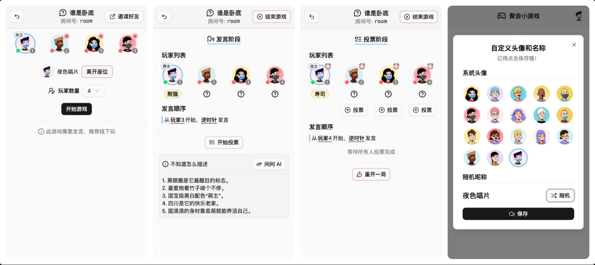

## 聚会小游戏 (party-games)

结合 AI 添加更多游戏乐趣

### 开发计划

- [x] 谁是卧底
- [ ] 五子棋
- [ ] 一夜狼
- [ ] 更多小游戏

### 预览图




### 本地运行

**macOS ⬇️**

```shell
# 安装 bun
brew install oven-sh/bun/bun

# 前端打包
cd web && bun install && bun run build && cd -

# 环境变量
export OAI_MODEL=gpt-3.5-turbo
export OAI_BASE_URL=https://api.openai.com
export OAI_API_KEY=sk-xxx

# 运行 127.0.0.1:3000
go run cmd/main.go
```